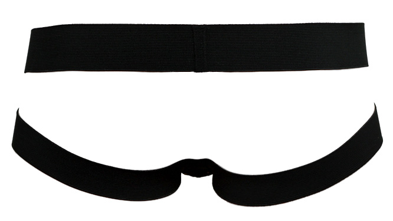

&block;&block;&block;&block;&block;&block;&block;&block;&block;&block;&block;&block;&block;&block;&block;&block;&block;&block;&block;&block;&block;&block;&block;&block;&block;&block;&block;&block;&block;&block;&block;&block;&block;&block;&block;&block;&block;&block;&block;&block;&block;&block;&block;&block;&block;&block;&block;&block;&block;&block;&block;
### &spades; &spades; &spades; &spades; &spades; &spades; &spades; &spades; &spades; &spades; &spades; &spades; &spades; &spades; &spades; &spades; &spades; &spades; &rfr;&efr;&yfr;&nfr;&ofr;&lfr;&dfr;&sfr;.&jfr;&sfr; &spades; &spades; &spades; &spades; &spades; &spades; &spades; &spades; &spades; &spades; &spades; &spades; &spades; &spades; &spades; &spades; &spades;
&block;&block;&block;&block;&block;&block;&block;&block;&block;&block;&block;&block;&block;&block;&block;&block;&block;&block;&block;&block;&block;&block;&block;&block;&block;&block;&block;&block;&block;&block;&block;&block;&block;&block;&block;&block;&block;&block;&block;&block;&block;&block;&block;&block;&block;&block;&block;&block;&block;&block;&block;

# &#8196;jock

# &#8196;&jsercy;


# &#8196;jock


### &boxDR;&boxH;&boxDL;&boxDR;&boxDL;&boxDR;&boxDL;&boxDR;&boxDL;&boxDR;&boxDL;&boxDR;&boxDL;&boxDR;&boxDL;&boxDR;&boxDL;&boxDR;&boxDL;&boxDR;&boxDL;&boxDR;&boxH;&boxDL;<br />&boxV;&#8197;&#8200;&#8197;&#8201;&boxUR;&boxUL;&boxUR;&boxUL;&boxUR;&boxUL;&boxUR;&boxUL;&boxUR;&boxUL;&boxUR;&boxUL;&boxUR;&boxUL;&boxUR;&boxUL;&boxUR;&boxUL;&boxUR;&boxUL;&#8197;&#8200;&#8197;&#8201;&boxV;<br />&boxV;&boxDR;&lobrk;&#8198;&nopf;&oopf;&topf;&#8194;&jopf;&uopf;&sopf;&topf;&#8194;&fopf;&oopf;&ropf;&#8196;&#8201;&#8201;&topf;&eopf;&sopf;&topf;&sopf;&#8194;&aopf;&nopf;&yopf;&mopf;&oopf;&ropf;&eopf;&#8198;&robrk;&boxH;&boxUL;<br />&boxV;&boxUR;&boxH;&boxH;&boxH;&boxH;&boxH;&boxH;&boxH;&boxH;&boxH;&boxH;&boxH;&boxH;&boxH;&boxH;&boxH;&boxH;&boxH;&boxH;&boxH;&boxDL;&boxDR;&boxDL;<br />&boxV;&boxDR;&boxDL;&boxDR;&boxH;&boxH;&boxH;&boxH;&boxH;&boxH;&boxH;&boxH;&boxH;&boxH;&boxH;&boxH;&boxDL;&boxDR;&boxDL;&boxDR;&boxDL;&boxV;&boxV;&boxV;<br />&boxV;&boxV;&boxV;&boxV;&boxDR;&boxH;&boxH;&boxH;&boxH;&boxH;&boxH;&boxH;&boxH;&boxH;&boxH;&boxH;&boxUL;&boxV;&boxV;&boxV;&boxV;&boxV;&boxV;&boxV;<br />&boxV;&boxV;&boxV;&boxV;&boxV;&boxDR;&lobrk;&#8201;&square;&#8201;&roarr;&#8201;&sopf;&mopf;&oopf;&copf;&kopf;&#8201;&rrarr;&#8201;&boxbox;&#8201;&robrk;&boxH;&boxUL;&boxV;&boxV;&boxV;&boxV;&boxV;&boxV;<br />&boxV;&boxV;&boxV;&boxV;&boxV;&boxV;&boxDR;&boxH;&boxH;&boxH;&boxH;&boxH;&boxH;&boxH;&boxH;&boxH;&boxH;&boxH;&boxUL;&boxV;&boxV;&boxV;&boxV;&boxV;<br />&boxV;&boxV;&boxUR;&boxUL;&boxUR;&boxUL;&boxUR;&boxH;&boxH;&boxH;&boxH;&boxH;&boxH;&boxH;&boxH;&boxH;&boxH;&boxH;&boxH;&boxUL;&boxUR;&boxUL;&boxV;&boxV;<br />&boxV;&boxUR;&boxH;&boxH;&boxH;&boxH;&boxH;&boxH;&boxH;&boxH;&boxH;&boxH;&boxH;&boxH;&boxH;&boxH;&boxH;&boxH;&boxH;&boxH;&boxH;&boxH;&boxUL;&boxV;<br />&boxV;&boxDR;&lobrk;&#8200;&aopf;&#8194;&mopf;&oopf;&copf;&kopf;&iopf;&nopf;&gopf;&#8194;&lopf;&iopf;&bopf;&ropf;&aopf;&ropf;&yopf;&#8194;&fopf;&oopf;&ropf;&#8194;&sopf;&wopf;&iopf;&fopf;&topf;&#8200;&robrk;&boxH;&boxUL;<br />&boxV;&boxUR;&boxH;&boxH;&boxH;&boxH;&boxH;&boxH;&boxH;&boxH;&boxH;&boxH;&boxH;&boxH;&boxH;&boxH;&boxH;&boxH;&boxH;&boxH;&boxH;&boxH;&boxH;&boxDL;<br />&boxV;&boxDR;&boxDL;&boxDR;&boxDL;&boxDR;&boxDL;&boxDR;&boxDL;&boxDR;&boxDL;&boxDR;&boxDL;&boxDR;&boxDL;&boxDR;&boxDL;&boxDR;&boxDL;&boxDR;&boxDL;&boxDR;&boxDL;&boxV;<br />&boxUR;&boxUL;&boxUR;&boxUL;&boxUR;&boxUL;&boxUR;&boxUL;&boxUR;&boxUL;&boxUR;&boxUL;&boxUR;&boxUL;&boxUR;&boxUL;&boxUR;&boxUL;&boxUR;&boxUL;&boxUR;&boxUL;&boxUR;&boxUL;


### &boxDR;&boxH;&boxH;&boxH;&boxH;&boxH;&boxH;&boxH;&boxH;&boxH;&boxH;&boxH;&boxH;&boxH;&boxH;&boxH;&boxH;&boxH;&boxH;&boxH;&boxH;&boxH;&boxH;&boxDL;<br />&boxV;&#8197;&#8200;&#8197;&#8201;&boxDR;&boxH;&boxH;&boxH;&boxH;&boxH;&boxH;&boxH;&boxH;&boxH;&boxH;&boxH;&boxH;&boxH;&boxH;&boxH;&boxH;&boxH;&boxH;&boxDL;&#8197;&#8200;&#8197;&#8201;&boxV;<br />&boxV;&boxDR;&lobrk;&#8198;&nopf;&oopf;&topf;&#8194;&jopf;&uopf;&sopf;&topf;&#8194;&fopf;&oopf;&ropf;&#8196;&#8202;&#8201;&topf;&eopf;&sopf;&topf;&sopf;&#8194;&aopf;&nopf;&yopf;&mopf;&oopf;&ropf;&eopf;&#8198;&robrk;&boxDL;&boxV;<br />&boxV;&boxV;&boxV;&boxDR;&boxH;&boxH;&boxH;&boxH;&boxH;&boxH;&boxH;&boxH;&boxH;&boxH;&boxH;&boxH;&boxH;&boxH;&boxH;&boxH;&boxDL;&boxV;&boxV;&boxV;<br />&boxV;&boxV;&boxV;&boxV;&boxDR;&boxH;&boxH;&boxH;&boxH;&boxH;&boxH;&boxH;&boxH;&boxH;&boxH;&boxH;&boxH;&boxH;&boxH;&boxDL;&boxV;&boxV;&boxV;&boxV;<br />&boxV;&boxV;&boxV;&boxV;&boxV;&boxDR;&boxH;&boxH;&boxH;&boxH;&boxH;&boxH;&boxH;&boxH;&boxH;&boxH;&boxH;&boxH;&boxDL;&boxV;&boxV;&boxV;&boxV;&boxV;<br />&boxV;&boxV;&boxV;&boxV;&boxV;&boxV;&nbsp;&lobrk;&square;&nbsp;&roarr;&nbsp;&sopf;&mopf;&oopf;&copf;&kopf;&nbsp;&rrarr;&nbsp;&boxbox;&robrk;&nbsp;&boxV;&boxV;&boxV;&boxV;&boxV;&boxV;<br />&boxV;&boxV;&boxV;&boxV;&boxV;&boxUR;&boxH;&boxH;&boxH;&boxH;&boxH;&boxH;&boxH;&boxH;&boxH;&boxH;&boxH;&boxH;&boxUL;&boxV;&boxV;&boxV;&boxV;&boxV;<br />&boxV;&boxV;&boxV;&boxV;&boxUR;&boxH;&boxH;&boxH;&boxH;&boxH;&boxH;&boxH;&boxH;&boxH;&boxH;&boxH;&boxH;&boxH;&boxH;&boxUL;&boxV;&boxV;&boxV;&boxV;<br />&boxV;&boxV;&boxV;&boxUR;&boxH;&boxH;&boxH;&boxH;&boxH;&boxH;&boxH;&boxH;&boxH;&boxH;&boxH;&boxH;&boxH;&boxH;&boxH;&boxH;&boxUL;&boxV;&boxV;&boxV;<br />&boxV;&boxUR;&lobrk;&#8200;&aopf;&#8194;&mopf;&oopf;&copf;&kopf;&iopf;&nopf;&gopf;&#8194;&lopf;&iopf;&bopf;&ropf;&aopf;&ropf;&yopf;&#8194;&fopf;&oopf;&ropf;&#8194;&sopf;&wopf;&iopf;&fopf;&topf;&#8200;&robrk;&boxUL;&boxV;<br />&boxV;&#8197;&#8200;&#8197;&#8201;&boxUR;&boxH;&boxH;&boxH;&boxH;&boxH;&boxH;&boxH;&boxH;&boxH;&boxH;&boxH;&boxH;&boxH;&boxH;&boxH;&boxH;&boxH;&boxH;&boxUL;&#8197;&#8200;&#8197;&#8201;&boxV;<br />&boxUR;&boxH;&boxH;&boxH;&boxH;&boxH;&boxH;&boxH;&boxH;&boxH;&boxH;&boxH;&boxH;&boxH;&boxH;&boxH;&boxH;&boxH;&boxH;&boxH;&boxH;&boxH;&boxH;&boxUL;

# in·ter·me·di·ate
### /ˌin(t)ərˈmēdēət/
*a build tool*

 1. Provides a data structure between API specification formats and templating/transformation libraries.
    - implemented in node.js
    - via cli, commonjs (es5) or es2015 modules
    - work in progress... not yet at 1.0 release
    - input/output formats may be extended beyond API specs
  
<h1 align="center">&xhArr;</h1>

### &rdsh; input

#### API specification formats 

- [x] swagger 2.0
- [ ] apiblueprint
- [ ] RAML
- [ ] Formats will be added as needed.. **pull requests welcome**

### intermediate &crarr;

#### intermediate JSON format

To see the JSON schema examples/proposals check out the [intermediate/schemas directory](intermediate/schemas).

A plugin architecture is provided to customize the intermediate structure.

### &rdsh; output

Currently generates:

- [x] apidoc
- [x] ejs
- [x] jasmine
- [x] sdk (javascript)
- [x] routes (express, restify, etc)
- [ ] Formats will be added as needed.. **pull requests welcome**

<h1 align="center">&xhArr;</h1>

### &DownArrowBar; installation

```bash
    $ npm install intermediate -D
```

### &lrarr; usage

#### cli

```bash
    $ intermediate [options] <filename>
```
#### commonjs (es5)

```javascript
    
    var intermediate = require("intermediate");
     
    intermediate("specs/api.json", function(err, data){ 
        
        if(err){ return err; }
        
        return someTemplateEngine.render(loadTemplate(), data);
      }
    );
```
#### es2015 modules

```javascript
    
    import intermediate from "intermediate"
    
    // Promises 
    intermediate("specs/api.json")
    .then( data => {
        var someTemplate = loadTemplate()
        return someTemplateEngine.render(someTemplate, data)
    });
    
    // ES7 
    const data = await intermediate("specs/api.json")
    
    const someTemplate = loadTemplate()
    const output = someTemplateEngine.render(someTemplate, data)
    
```
### &orarr; extend

Input handling and output transforms are performed by plugins.

*Currently under development, documentation to follow*

### &UpArrowBar; disclaimer

This is primarily a personal/internal tool which is open sourced in case others find it useful.

It is not a product or service and may have limited to no support at times.

It makes no guarantees, warranties or promises just JSON.
 
That said, it is heavily tested and built to be production-friendly (although as just a simple build tool, wtfc)

Use as you wish, where you wish and with whom ever you want.

**As always, all comments, pull requests or issues are welcome and appreciated**

<h1 align="center">&xhArr;</h1>
